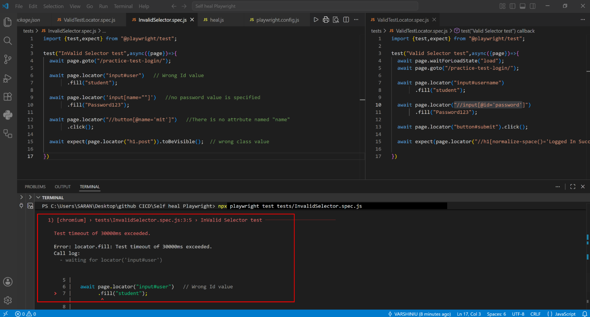
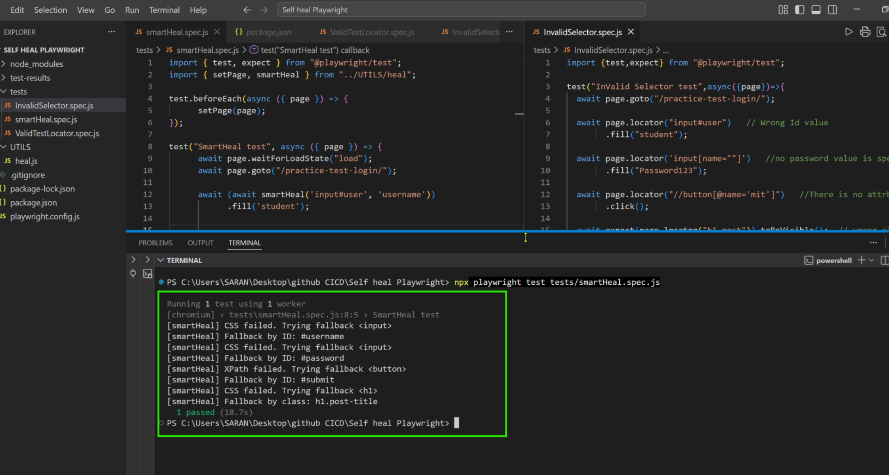
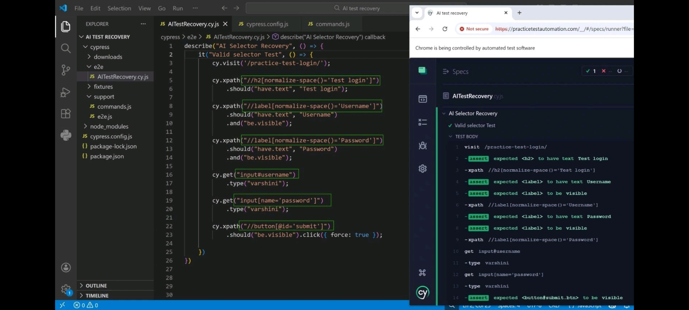
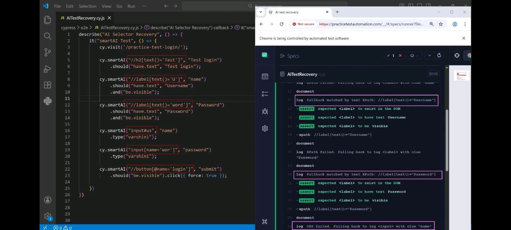

# Hi, I'm Varshini U 👋

### Automation QA Engineer · Selenium · Playwright · Cypress · Appium · CI/CD

---

# 👩‍💼 About Me

I'm a passionate **Automation Test Engineer & QA Trainer** focused on building scalable automation frameworks across Web, API, and Mobile platforms.

- 🔧 Developed and maintained **500+ automated test scenarios**
- 📉 Reduced manual testing effort by **60%**
- ⚡ Improved QA cycle efficiency by **40%**
- 🌐 Cross-platform testing — **Android, iOS, Chrome, Firefox, Safari**
- ☁️ Hands-on with **BrowserStack**, GitHub Actions & CI/CD pipelines
- 🧠 Creator of **SmartGet/SmartHeal AI** — self-healing selector engine for Cypress & Playwright
- 🎓 Delivered practical automation training to aspiring QA engineers
- 💼 Open to **Automation QA Engineer / SDET** opportunities

---

# 🛠️ Tech Stack

## 🚀 Automation

---

## 💻 Languages

---

## 🧪 Testing & QA

---

## ⚙️ CI/CD & Tools

---

# 🚀 Featured Projects

## 🧠 [SmartHeal AI — Self-Healing Automation Engine for Playwright](https://github.com/VARSHINIU/SmartHeal_Test_Recovery)
[🌐Live Demo Website](https://sites.google.com/view/smartheal-self-healingselector/home)  

> Playwright · JavaScript · AI-Inspired Recovery Logic

Built a custom self-healing automation utility capable of automatically recovering broken CSS/XPath selectors caused by dynamic DOM changes.

The framework intelligently identifies fallback elements using:
- text similarity
- ID matching
- class-based scoring
- fallback locator prioritization

### ✨ Key Features
- Plugin-free implementation
- Handles broken selectors dynamically
- Reduces flaky test failures
- Reusable utility-based architecture
- Async-based smart locator recovery system

---
## 🧠 [SmartGet AI — Self-Healing Automation Engine for Cypress](https://github.com/VARSHINIU/SmartGet_Test_Recovery)
[🌐Live Demo Website](https://sites.google.com/view/smartelementdetect-varshini/self-healing-selectors)  

>  Cypress · JavaScript · AI-Inspired Recovery Logic

Built a custom self-healing automation utility capable of automatically recovering broken CSS/XPath selectors caused by dynamic DOM changes.

The framework intelligently identifies fallback elements using:
- text similarity
- ID matching
- class-based scoring
- fallback locator prioritization

### ✨ Key Features
- Plugin-free implementation
- Handles broken selectors dynamically
- Reduces flaky test failures
- Reusable utility-based architecture

---
## ☕ [Medusa E-Commerce (end-toend) — Selenium](https://github.com/VARSHINIU/Medusa_Ecommerce_EndToEndAutomation)

> Selenium WebDriver · Java · TestNG · Page Object Model

Comprehensive E2E automation framework using:
- POM Design Pattern
- Data-Driven Testing
- TestNG Assertions
- Reporting utilities
- Reusable framework structure

---

## 🛒 [Medusa E-Commerce (end-to-end) — Playwright](https://github.com/VARSHINIU/Medusa_EndToEnd_Playwright)

> Playwright · JavaScript · Node.js · PostgreSQL

End-to-end automation of a modern e-commerce platform covering:
- Login & Authentication
- Product Search
- Cart & Checkout
- Order Validation
- API Assertions
- CI/CD execution

---

## 🧾 [Backend API Automation — Cypress](https://github.com/VARSHINIU/SAAS_Cypress_Backend)

> Cypress · JavaScript · PostgreSQL · API Testing

Backend automation framework validating:
- REST APIs
- Database integrity
- Payload validations
- Authentication
- Response assertions

Includes custom Cypress tasks & reporting integration.

---

## ⚙️ [Playwright + GitHub Actions CI/CD](https://github.com/VARSHINIU/Playwright_GithubActions)

> Playwright · GitHub Actions · YAML

Automated test execution pipeline configured using GitHub Actions.

### Features
- Trigger on push/pull request
- Automated execution
- HTML report upload
- CI-ready Playwright framework

---

## ⚙️ [Selenium GitHub Workflow — CI/CD Automation](https://github.com/VARSHINIU/Selenium_GithubWorkflow)

> Selenium WebDriver · Java · TestNG · GitHub Actions · Maven

Implemented a complete CI/CD automation workflow integrating Selenium test execution with GitHub Actions.

### ✨ Features
- Automated Selenium test execution on every push
- Maven dependency caching using `.m2`
- Java setup with Temurin JDK
- TestNG report generation
- Artifact upload support
- Cross-platform GitHub runner support
- CI-ready automation framework

### 🔄 Workflow Includes
- Repository checkout
- JDK installation
- Maven dependency management
- Cache optimization
- Automated test execution
- Report publishing

### 🚀 Tech Used
- Selenium WebDriver
- Java
- Maven
- GitHub Actions
- YAML
- TestNG

---

# 🏆 Highlights

| Metric | Achievement |
|---|---|
| 🧠 Innovation | Built SmartGet & SmartHeal AI self-healing locator engines for Cypress & Playwright |
| 🧪 Automated Test Scenarios | 500+ |
| 📉 Manual Testing Reduction | 60% |
| ⚡ QA Cycle Optimization | 40% |
| 📱 Platforms Covered | Web, Android, iOS |
| 🌐 Browsers Tested | Chrome, Firefox, Safari |
| 👩‍🏫 Learners Trained | 10+ |

---

# 📜 Certifications

🎓 Selenium Automation Testing — Test Automation University (TAU)

🎓 Microsoft Learn — GitHub Copilot Learning Path

🎓 Oracle Badge- Foundations of Java

🎓 Udemy- Appium with Android & IOS

---

# 🌱 Currently Exploring

- AI-Powered Test Automation
- Self-Healing Frameworks
- Playwright Advanced Architecture
- GitHub Actions CI/CD
- API Security Testing
- Smart Reporting & Observability

---

# 🤝 Let's Connect

💼 LinkedIn:
https://www.linkedin.com/in/u-varshini/

💻 GitHub:
https://github.com/VARSHINIU

📧 Email:
varshiniuu@gmail.com

---

> *"Quality is not an act, it is a habit."*  
> Building smarter and more resilient automation systems 🚀